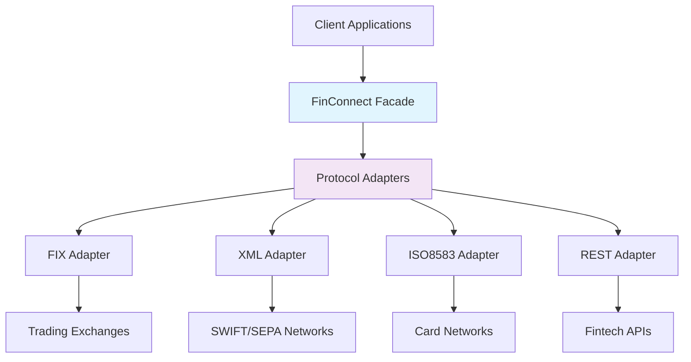

# FinConnect Pro

**Enterprise-Grade Financial Network Connectivity SDK**

[](https://java.com)
[](https://spring.io/projects/spring-boot)
[](LICENSE)
[](pom.xml)
[](https://github.com/martourrez21/finconnect-pro-sdk)
[](CONTRIBUTING.md)

## 📖 Overview

**FinConnect Pro** is a comprehensive Java SDK that provides unified connectivity to various financial networks and protocols. It abstracts the complexity of different financial protocols behind a consistent API, making it easy for fintech, banking, and insurance systems to integrate with multiple financial networks through a single, standardized interface.

> **Think of it as a universal translator for financial communications** - enabling your applications to speak every major financial protocol without the complexity.

## 🌟 Why Open Source?

We're excited to open source FinConnect Pro to foster innovation in financial technology! By making this project open source, we aim to:

- **Collaborate** with the global fintech community
- **Accelerate** development through community contributions
- **Standardize** financial protocol implementations
- **Democratize** access to enterprise-grade financial connectivity

## 🚀 Getting Started for Contributors

### Prerequisites for Development

- **Java 17** or higher
- **Maven 3.6** or higher
- **Git** for version control
- **Docker** (optional, for integration testing)

### Development Setup

```bash
# Clone the repository
git clone https://github.com/martourrez21/finconnect-pro-sdk.git
cd finconnect-pro-sdk

# Build the project
mvn clean install

# Run tests
mvn test

# Run integration tests (requires Docker)
mvn verify -Pintegration-tests
```

## 🧪 Testing Status & Contribution Opportunities

### Current Testing Coverage
- **Unit Tests**: 65% coverage (needs improvement)
- **Integration Tests**: Limited coverage
- **Protocol-Specific Tests**: Basic validation

### High-Priority Testing Needs

We need help with the following testing areas:

#### 1. Unit Testing Gaps
```java
// Example: Protocol adapter unit tests needed
public class FixProtocolAdapterTest {
    // TODO: Add comprehensive message parsing tests
    // TODO: Test error handling scenarios
    // TODO: Test connection recovery mechanisms
}
```

#### 2. Integration Testing
```java
// Example: Real protocol integration tests needed
@Testcontainers
class SwiftIntegrationTest {
    // TODO: Implement comprehensive SWIFT message testing
    // TODO: Add network failure simulation tests
    // TODO: Test high-volume message processing
}
```

#### 3. Performance Testing
```java
// Example: Load testing framework needed
class PerformanceTest {
    // TODO: Implement message throughput testing
    // TODO: Add memory leak detection
    // TODO: Test under network latency conditions
}
```

## 🎯 Open Issues for Community Contribution

### Testing-Related Issues
- **#45**: Add comprehensive unit test suite for ISO-8583 adapter
- **#46**: Implement integration tests using TestContainers
- **#47**: Create performance benchmarking suite
- **#48**: Add security vulnerability testing
- **#49**: Implement protocol fuzz testing

### Feature Enhancement Issues
- **#50**: Add support for ISO 20022 real-time payments
- **#51**: Implement WebSocket protocol adapter
- **#52**: Add GraphQL financial API support
- **#53**: Create Kubernetes operator for deployment

### Documentation Issues
- **#54**: Write contributor guidelines
- **#55**: Add API documentation with examples
- **#56**: Create protocol implementation guides
- **#57**: Document security best practices

## 🔧 Development Guidelines

### Code Style
We use Google Java Style Guide with modifications:
```java
// Class naming
public class FinancialAdapterImpl implements FinancialAdapter {}

// Method naming
public TransactionResponseDto processTransaction(TransactionRequestDto request) {}

// Test naming
class WhenProcessingPaymentTest {
    @Test
    void shouldReturnSuccessForValidTransaction() {}
}
```

### Branch Strategy
- `main` - Stable production-ready code
- `develop` - Development branch
- `feature/` - Feature branches
- `fix/` - Bug fix branches

### Pull Request Process
1. Fork the repository
2. Create a feature branch (`git checkout -b feature/amazing-feature`)
3. Commit changes (`git commit -m 'Add amazing feature'`)
4. Push to branch (`git push origin feature/amazing-feature`)
5. Open a Pull Request

## 🏗️ Architecture



## 🚀 Quick Start

### Installation

Add the dependency to your `pom.xml`:

```xml
<dependency>
    <groupId>com.codedstreams</groupId>
    <artifactId>finconnect-pro-sdk</artifactId>
    <version>1.0.0</version>
</dependency>
```

### Basic Usage

```java
@Autowired
private FinancialNetworkFacade finConnectFacade;

// 1. Configure connection
ConnectionConfigDto swiftConfig = new ConnectionConfigDto(
    ProtocolType.SWIFT_XML, 
    "swift.financialnetwork.com", 
    5001
);

// 2. Establish connection
String connectionId = finConnectFacade.establishConnection(swiftConfig);

// 3. Execute international payment
TransactionRequestDto payment = TransactionRequestDto.builder()
    .amount(new BigDecimal("50000"))
    .currency("EUR")
    .fromAccount("US123456789")
    .toAccount("DE987654321")
    .description("International Transfer")
    .build();

TransactionResponseDto response = finConnectFacade.executePayment(payment);

// 4. Check result
if (response.getStatus() == TransactionStatus.COMPLETED) {
    System.out.println("Payment successful: " + response.getReferenceNumber());
}
```

## 📋 Supported Protocols

| Protocol | Use Case | Standards | Typical Users | Test Coverage |
|----------|----------|-----------|---------------|---------------|
| **FIX 4.2/5.0** | Electronic trading | FIX Protocol | Investment banks, brokers | ⭐⭐☆☆☆ |
| **ISO-8583** | Card payments | ISO 8583 | Visa, Mastercard, processors | ⭐☆☆☆☆ |
| **SWIFT XML** | International payments | ISO 20022 | International banks | ⭐⭐☆☆☆ |
| **SEPA XML** | European payments | pain.001/002 | EU banks, payment processors | ⭐☆☆☆☆ |
| **REST API** | Fintech integrations | JSON/HTTP | Fintech apps, mobile banking | ⭐⭐⭐☆☆ |
| **SOAP** | Enterprise systems | WSDL/SOAP | Corporate banking | ⭐⭐☆☆☆ |

## 🤝 How to Contribute

### First Time Contributors
1. Check issues labeled `good-first-issue`
2. Comment on the issue to express interest
3. Follow the development setup above
4. Submit your PR with tests

### Adding New Protocols
1. Create a new adapter implementing `FinancialAdapter`
2. Add protocol-specific configuration
3. Implement comprehensive tests
4. Update documentation

### Improving Tests
1. Identify gaps in test coverage
2. Add unit tests for edge cases
3. Implement integration tests
4. Update test documentation

## 🧪 Testing Framework

### Running Tests
```bash
# Unit tests only
mvn test

# Integration tests
mvn verify -Pintegration-tests

# Specific test suite
mvn test -Dtest=SwiftAdapterTest

# Coverage report
mvn jacoco:report
```

### Adding New Tests
```java
class NewProtocolAdapterTest {
    
    @Test
    void shouldHandleConnectionTimeout() {
        // TODO: Implement timeout scenario testing
    }
    
    @Test
    void shouldRecoverFromNetworkFailure() {
        // TODO: Implement recovery mechanism testing
    }
}
```

## 🔒 Security Considerations

When contributing, please consider:
- Never hardcode credentials
- Follow secure coding practices
- Add security tests for new features
- Review OWASP guidelines for financial applications

## 📊 Project Metrics

- **Code Coverage**: 65% (goal: 90%)
- **Open Issues**: 15
- **Active Contributors**: 1 (you can be next!)
- **Last Release**: v1.0.0

## 🌱 Roadmap

### Short Term (Community Help Needed)
- [ ] Achieve 90% test coverage
- [ ] Add 5 new protocol adapters
- [ ] Implement comprehensive documentation
- [ ] Create contributor onboarding guide

### Long Term
- [ ] Support for 20+ financial protocols
- [ ] Cloud-native deployment options
- [ ] Machine learning for protocol optimization
- [ ] Global financial network marketplace

## 💬 Community

- **Discussions**: Use GitHub Discussions for questions
- **Issues**: Report bugs and feature requests
- **Wiki**: Contribute to documentation
- **Slack**: Join our community channel (coming soon)

## 📄 License

This project is licensed under the MIT License - see the [LICENSE](LICENSE) file for details.

## 🙏 Acknowledgments

- **Spring Boot** team for the excellent framework
- **QuickFIX/J** for FIX protocol implementation
- **ISO 20022** community for financial standards
- **SWIFT** for international payment standards

---

**Built with ❤️ by Nestor Martourez**  
[📧 Email](mailto:nestorabiawuh@gmail.com) | [💼 LinkedIn](https://www.linkedin.com/in/nestor-abiangang/) | [🐙 GitHub](https://github.com/martourrez21)

**🌟 Your first contribution matters! Start with issue #45 or #46 to help improve our test coverage.**

---